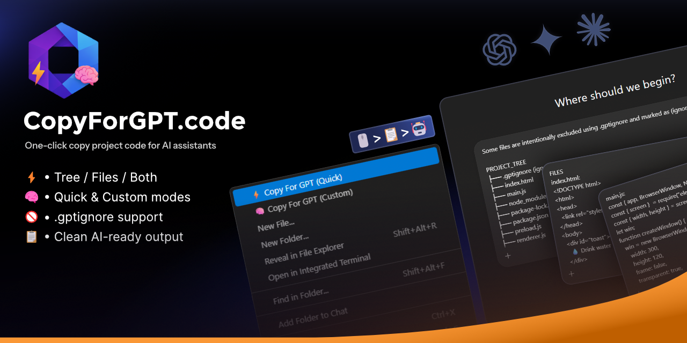

# Copy For GPT

> Instantly copy your project tree and files to the clipboard, formatted in a clean, AI-friendly way for GPT and other AI assistants.

**Copy For GPT** is a Visual Studio Code extension designed to remove friction when sharing project context with AI tools.

Instead of manually selecting files or explaining your project structure, you can copy everything in seconds — cleanly, consistently, and intelligently.

---

## ✨ Features

- 📁 **Copy project structure (tree)**
- 📄 **Copy file contents**
- ⚡ **Quick mode**
  - Tree + all files
  - No prompts, one click
- 🧠 **Custom mode**
  - Both / Tree only / Files only
  - Filter by extensions (`js`, `html`, `css`, etc.)
  - Set a maximum file size
  - 🎯 **Copy selected files**
  - Right-click one or more files
  - Copies only those files (folders excluded)
  - Perfect for sharing focused context with GPT
- 🚫 **Supports `.gptignore`**
  - Automatically created on first run if missing
  - Similar to `.gitignore`
  - Ignored files are clearly marked in the tree
- 🤖 **AI-friendly output**
  - Clear section headers (`PROJECT_TREE`, `FILES`)
  - Minimal noise, easy to parse for AI models
- 📊 **Displays number of copied files**
- 📋 **Output copied directly to the clipboard**
- 🖱 **Available via right-click on a folder in the VS Code Explorer**

---

## 🚀 Usage

### Right-click workflow

1. Right-click a folder in the VS Code Explorer  
2. Select **Copy For GPT**  
3. Choose a mode:
   - **Quick** → copies tree + all files instantly
   - **Custom** → choose what to copy and apply filters  
4. Paste directly into GPT or any AI assistant

### Copy selected files

1. Select one or more files in the VS Code Explorer  
2. Right-click the selection  
3. Choose **Copy For GPT (Selected Files)**  
4. Paste directly into GPT or any AI assistant  

> Note: This option only appears when **files only** are selected (no folders).

---

## ⚡ Copy Modes

### Quick Mode

- Copies:
  - Project tree
  - All files
- No questions asked
- Uses default settings
- Ideal for fast context sharing

---

### Custom Mode

- Choose what to copy:
  - **Both**
  - **Tree only**
  - **Files only**
- Optionally filter by extensions:
  - `js`
  - `html`
  - `css`
  - etc.
- Optionally define a maximum file size (in KB)

---

## 🚫 `.gptignore`

If a `.gptignore` file does not exist in the selected folder, it is automatically created on first use.

You can edit it to exclude files or folders from being copied.

### Example

```txt
node_modules
dist
.env
*.log
*.map
```

### Rules

- One rule per line
- Supports wildcards (`*.ext`)
- Paths are relative to the project root
- Ignored files still appear in the tree, marked as (ignored)

---

## 🤖 Why Copy For GPT?

AI assistants work best with **full and accurate project context**.

This extension helps you:
- Share **entire projects or just the exact files you need**
- Avoid missing files
- Avoid copy/paste errors
- Share consistent project structure
- Reduce prompt preparation time
- Focus on solving problems, not formatting context

---

## 📄 Example Output

Below is an example of what gets copied to the clipboard.

```
Some files are intentionally excluded using .gptignore and marked as (ignored) in the PROJECT_TREE.

PROJECT_TREE
├── .gptignore (ignored)
├── src
│   ├── index.js
│   └── utils.js
├── package.json
└── README.md

FILES
src/index.js :
import { helper } from "./utils";

function main() {
  console.log("Hello GPT");
}

main();

src/utils.js :
export function helper() {
  return "Useful context for GPT";
}

package.json :
{
  "name": "example-project",
  "version": "1.0.0"
}

README.md :
# Example Project

This is a simple project used to demonstrate how Copy For GPT
shares full project context with AI assistants.
```

## ⚠️ Known Limitations

- Very large files may be skipped depending on configuration
- Binary files are ignored
- Clipboard size depends on the operating system

---

## 🛠 Development

This extension is built using:
- Visual Studio Code Extension API
- Node.js
- A custom CLI (`copy-gpt`) under the hood

---

## 📦 Installation

Available via the **Visual Studio Code Marketplace**.

You can also install it locally using a `.vsix` package.

---

## 📝 License

MIT

---

**Enjoy faster AI-assisted development 🚀**